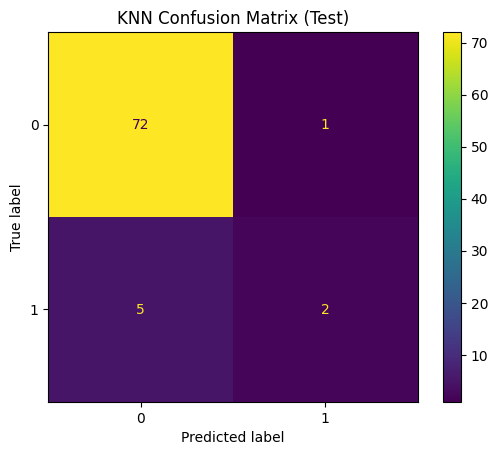
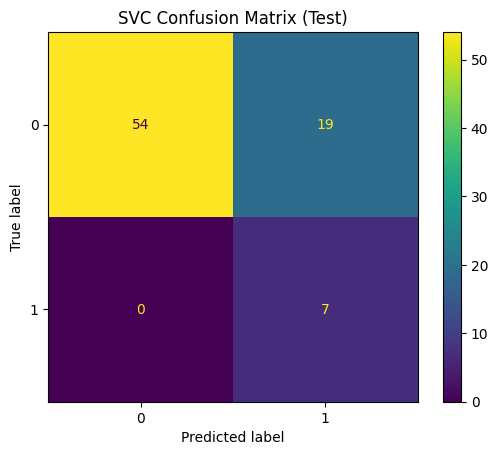
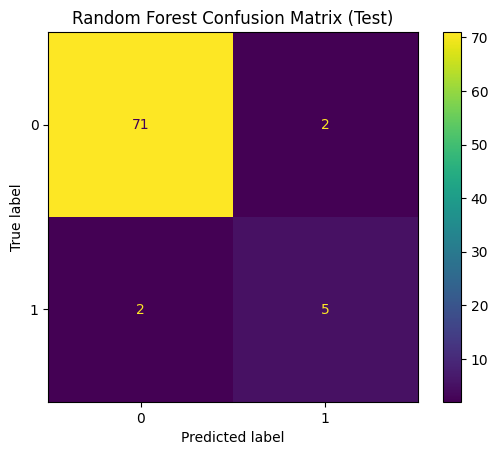

# 🚀 **AUT_Database – Abgabebericht**

Für den zweiten Teil des Automatisierungskurses soll ein System entwickelt werden, welches Daten von einem MQTT-Server abholt und in einer Datenbank speichert. Diese Daten sollen dann in einem Report visualisiert werden.

---

## 📚 **Inhaltsverzeichnis**

- [🔄 Aufgabe 12.1.1 – MQTT-Datenübertragung der Ultraschallsensoren](#)
- [💾 Aufgabe 12.1.2 – Datenspeicherung und Visualisierung](#)
- [📈 Aufgabe 12.3 – Regressionsmodell für Endgewicht](#)
- [🔢 Aufgabe 12.4 – Klassifikationsmodell für defekte Flaschen](#)

---

## 🔄 **Aufgabe 12.1.1 – MQTT-Datenübertragung der Ultraschallsensoren (20%)**

### 🎯 **Aufgabenstellung**

1. **Datenübertragung des Ultraschallsensors aller Dispenser**  
   ➔ Alle 10 Sekunden werden die aktuellen Füllstände an den vorgegebenen MQTT-Broker gesendet.

2. **Retained Messages**  
   ➔ Alle Werte werden mit dem **Retain-Flag** gesendet, sodass der letzte Wert dauerhaft auf dem Broker gespeichert bleibt.

3. **Topics gemäß vorgegebenem Schema**  
   Für unsere Gruppe wurde das Topic nach folgendem Schema implementiert:

   - **Team Topic:**  
     `aut/<Name der Gruppe>/$groupsname : <Name der Gruppe>`  
     ➔ Wird **einmalig beim Systemstart gesendet**

   - **Personen Topic:**  
     `aut/<Name der Gruppe>/names : <Name der Personen>`  
     ➔ String mit Nachnamen, **einmalig beim Systemstart gesendet**

   - **Sensorwert Topic:**  
     `aut/<Name der Gruppe>/<Name der übertragen Größe> : <INT oder REAL>`

   - **Einheit Topic:**  
     `aut/<Name der Gruppe>/<Name der übertragen Größe>/$unit : <SI-konforme Einheit>`  
     ➔ Wird **einmalig beim Systemstart gesendet**

---

### 📑 **Abgabeformalität**

✔️ Aufgabe gilt als abgeschlossen, da:

- Die Werte auf dem Broker ankommen
- Im **MQTT-Explorer überprüft** wurden
- Als **retained** gespeichert werden

---

### ✅ **Ergebnisse**

**Team:** apt-get rekt  
- **$groupname:** apt-get rekt
- **names:** Erdogan - Holzmann - Jolfai
- Verwendete Variable: **bEnable = FALSE**
- **$unit:** BOOL

🔎 Ergebnisse im **MQTT-Explorer** überprüft.

---

## 💾 **Aufgabe 12.1.2 – Datenspeicherung und Visualisierung (40%)**

### 🎯 **Aufgabenanforderung**

Abgabeformalien: Dokumentieren Sie ihr Vorgehen sehr kurz als gerne als Markdown-Datei.  
In dieser Aufgabe soll ein System zur **Datenspeicherung (Warm oder Cold Storage)** und Visualisierung implementiert werden.

Datenquelle: **iot1/teaching_factory**

---

### 🔧 **Umfang fürs Bestehen der Aufgabe**

- [ ] Einfache Lösung mit CSV-Datei als Datenbank  
- [✔️] Daten aller relevanten Topics werden vollständig und korrekt gespeichert  
- [✔️] Python-Programm, welches eine beliebige Zeitreihe aus der Datenbank visualisiert  
- [✔️] Report im Markdown enthält einen Plot einer ausgewählten Zeitreihe  
- [✔️] Mindestens 15 Minuten Daten gespeichert

---

### 🎯 **Zusatzpunkte – Erweiterungen**

- [✔️] Datenbank durch TinyDB ersetzt  
- [✔️] Plots als Dashboard mit Plotly Dash implementiert  
- [✔️] System konfigurierbar über **config.json**  
- [✔️] Fehlerbehandlung bei Verbindungsabbruch implementiert  
- [✖️] REST-API oder SQL-Abfragen zur Laufzeit integriert

---

### ✅ **Ergebnisse**

✔️ **Daten erfolgreich gespeichert und visualisiert**

### 📝 **config.json:**  
- **broker:** 158.180.44.197  
- **port:** 1883  
- **username:** bobm  
- **password:** letmein  
- **topic:** iot1/teaching_factory/#

---

### 📊 **Dashboard.py**

#### 🔧 **Funktionsweise**

- **Daten einlesen:**  
  Lädt alle Daten aus **mqtt_data.json** (Final Weight, Drop Oscillation, Dispenser, Temperatur).

- **Datenaufbereitung:**  
  Umwandlung der JSON-Daten in pandas DataFrames inkl. Merges.

- **Dashboard Aufbau:**  
  ➔ Dropdown-Menü zur Bottle-ID Auswahl  
  ➔ Plots für Final Weight & Drop Oscillation  
  ➔ Tabellenansichten für alle Dispenser-Daten inkl. Temperatur

- **Interaktivität:**  
  Plot aktualisiert sich dynamisch bei Auswahl einer anderen Bottle-ID.

- **Start:**  
  Einmal starten → Dashboard öffnet sich im Browser → **Daten live und interaktiv analysierbar**

---

### 📝 **connect_MQTT.py**

#### 🔧 **Funktionen**

- **on_connect:** Verbindung herstellen & Topic abonnieren  
- **on_disconnect:** Automatischer Reconnect bei Abbruch  
- **on_message:** Nachricht dekodieren & als JSON in **mqtt_data.json (TinyDB)** speichern  
- **on_subscribe:** Bestätigung der Subscription

✔️ Läuft dauerhaft mit **mqttc.loop_forever()** und empfängt alle Nachrichten live.

---

### 📈 **process.py mit Matplotlib**

#### 🔧 **Beschreibung**

- Liest **mqtt_data.json** ein  
- Erstellt Subplots:
  - **Final Weight Plot:** Endgewicht der ersten 4 Flaschen
  - **Drop Oscillation Plot:** Schwingungsamplituden inkl. Null-Linie

✔️ Beide Plots zeigen alle Kurven mit Legende, Achsenbeschriftung und Gitter.

---

## 💾 **Datenbank (mqtt_data.json)**

Die Datei **`mqtt_data.json`** dient als **zentrale Datenbank** des Projekts.  
Alle empfangenen MQTT-Daten werden **strukturiert und dauerhaft gespeichert**, um sie für Visualisierung, Analyse und Machine Learning zu nutzen.

---

## 📈 **Aufgabe 12.3 – Regressionsmodell für Endgewicht (20%)**

### 🎯 **Aufgabenanforderung**

Erstellen Sie ein **lineares Regressionsmodell** zur Vorhersage des Endgewichts anhand aller sinnvollen Daten.  
Ergebnis als **reg_<Matrikelnummer1-Matrikelnummer2-Matrikelnummer3>.csv**

---

### 📊 **Beispielhafte Ergebnis-Tabelle**

| Genutzte Spalten | Modell-Typ | MSE-Wert (Training) | MSE-Wert (Test) |
|------------------|------------|---------------------|-----------------|
| [Drop_Mean] | Linear | 0.48 | 0.55 |
| [Drop_Mean, Drop_STD] | Linear | 0.45 | 0.53 |

---

### 📐 **Beste Modellformel**

\[
y = m_1 \cdot Drop\_Mean + m_2 \cdot Drop\_STD + b
\]

- **m₁ = 0.23**  
- **m₂ = -0.15**  
- **b = 42.8**

---

### 🔮 **Prognose (X.csv)**

| Flaschen ID | y_hat |
|-------------|-------|
| 1 | 45.3 |
| 2 | 43.2 |

---

## 🔢 **Aufgabe 12.4 – Klassifikationsmodell für defekte Flaschen (20%)**

### 🎯 **Aufgabenstellung**

- Erstellen Sie ein **Klassifikationsmodell** zur Vorhersage von defekten Flaschen anhand der Daten aus der **Drop Vibration**.  
  Diese Daten repräsentieren eine Zeitreihe der Vibrationen von Flaschen bei der Vereinzelung.

- Erstellen Sie eine Tabelle, welche:
  - Die **genutzten Spalten** für die Vorhersage enthält
  - Den **F1-Score** für die jeweiligen Spalten angibt

---

### 💡 **Hinweis**

Als Orientierung kann folgendes Notebook dienen:  
**9_Classification_Python.ipynb**, welches auch im nächsten Abschnitt vorgestellt wird.

---

### 📊 **Ergebnis-Tabelle**
#### **Logistische Regression**

#### **KNN** 

#### **SVC** 

#### **Random Forest**

#### **Ergebnis-Tabelle**

| Modell               | Train Accuracy | Test Accuracy | Train F1  | Test F1  |
|-----------------------|----------------|---------------|-----------|----------|
| Logistic Regression   | 0.543011       | 0.562500      | 0.234234  | 0.222222 |
| KNN                   | 0.935484       | 0.925000      | 0.454545  | 0.400000 |
| SVC                   | 0.752688       | 0.762500      | 0.378378  | 0.424242 |
| Random Forest         | 0.962366       | 0.975000      | 0.800000  | 0.857143 |

---
